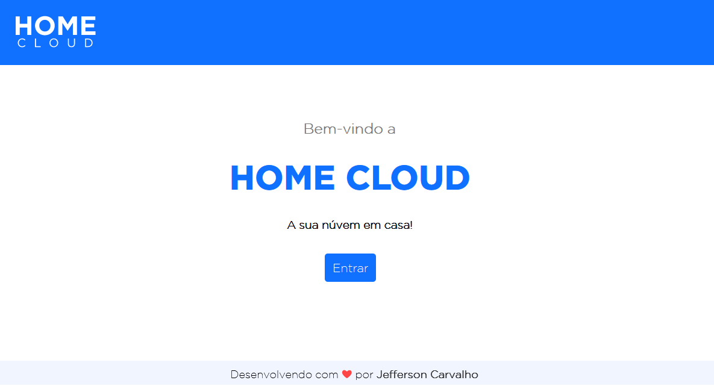

<h1 align="center" title="logo HOME CLOUD"></h1>
<h3>Home Cloud é um microprojeto pessoal voltado para pessoas que desejam fazer um armazenamento de arquivos de "nuvem" em casa.</h3>
<h5 style="text-align: center;"><i>Projeto em Desenvolvimento</i></h5>
<h1>Sobre</h1>

O sistema web <i><strong>Home Cloud</strong></i> pode facilitar o compartilhamento de arquivos acessando a mesma rede local. Na imagem a seguir, podemos ver a tela principal com alguns itens já adicionados.

<h1>Tecnologias Utilizadas</h1>
<ul>
    <li>ReactJS</li>
    <li>React Native</li>
    <li>NodeJS</li>
    <li>MySQL</li>
</ul>
<h1>Executando o Projeto</h1>

Este projeto é dividido em duas parte (por enquanto):

<ol>
    <li>Backend (pasta de servidor)</li>
    <li>Frontend (pasta web)</li>
    <li>Mobile <i>(em desenvolvimento)</i></li>
</ol>

O Backend é a parte mais importante, para fazer funcionar o frontend.

<h2>Pré-requisitos</h2>

Você vai precisar ter instalado em sua máquina as seguintes ferramentas:

<ul>
    <li>NodeJS</li>
    <li>Visual Studio Code</li>
    <li>Yarn (ou NPM)</li>
    <li>MySQL (ou um pacote de servidores como XAMPP por exemplo)</li>
</ul>
<h2>Iniciando o BackEnd (servidor)</h2>

Após instalado as ferramentas citadas nos pré-requisitos:

<ul>
    <li>Crie uma pasta no local onde deseja instalar o Home Cloud.</li>
    <li>Após isso, com o VS Code aberto, vá em <strong>Arquivo</strong> > <strong>Abrir Pasta</strong> e selecione a pasta que você criou.</li>
</ul>

`
    # Clone este repositório
    $ git clone https://github.com/myjefferson/home-cloud.git

    # Acesse a pasta do projeto no seu terminal/cmd
    $ cd README-ecoleta

    # Vá para a pasta da aplicação Front End
    $ cd web

    # Instale as dependências
    $ npm install

    # Execute a aplicação em modo de desenvolvimento
    $ npm run start

    # A aplicação será aberta na porta:3000 - acesse http://localhost:3000
`

